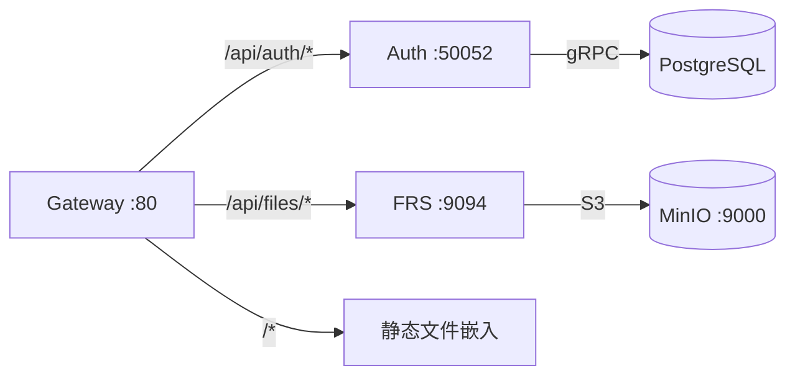

# upgo

全栈 Rust 应用程序，基于 Kubernetes 微服务架构。包含认证、账户、文件存储等微服务。

## 前置依赖

| 工具 | 安装方式 |
|------|---------|
| Rust 1.85+ | `curl --proto '=https' --tlsv1.2 -sSf https://sh.rustup.rs | sh` |
| Minikube | `brew install minikube`（macOS）或 minikube.sigs.k8s.io |
| kubectl | `brew install kubectl` |
| Docker | docker.com/products/docker-desktop |
| Just | `cargo install just` |
| Dagger | `curl -fsSL https://dl.dagger.io/dagger/install.sh | sh` |
| cargo-nextest | `cargo install cargo-nextest` |

## 一键部署

```bash
# 完整部署（缓存镜像 → 启动集群 → 构建服务 → 部署）
just deploy-all

# 查看部署状态
just verify
```

## 服务架构



## 项目结构

```
upgo/
├── frontend/
│   ├── auth/          # WASM 前端认证库
│   └── web/           # 静态文件（index.html）
├── services/
│   ├── auth/          # 认证微服务（gRPC）
│   ├── account/       # 账户微服务（开发中）
│   ├── gateway/       # API 网关（Axum 反向代理）
│   └── frs/           # 文件存储管理服务（MinIO S3）
├── contracts/         # proto 编译集中管理
├── k8s/
│   ├── base/          # k8s 基础设施清单
│   └── overlays/dev/  # 环境覆盖
├── ci/                # Dagger CI/CD 模块
├── doc/               # 设计文档与部署指南
├── Justfile           # 一键命令入口
└── Dockerfile.*       # 各服务多阶段构建文件
```

## 一键命令

```bash
# 基础设施
just k8s-up            # 启动 Minikube + 部署全部服务
just k8s-down          # 暂停
just k8s-reset         # 重置
just k8s-logs          # 查看日志

# 服务构建与部署
just build-auth        # 构建 Auth 镜像
just deploy-auth       # 部署 Auth
just build-auth-full   # 构建 + 加载 + 部署 Auth

just build-frs         # 构建 FRS 镜像
just deploy-frs        # 部署 FRS
just build-frs-full    # 构建 + 加载 + 部署 FRS

# 完整流程
just deploy-all        # 镜像缓存 → 启动集群 → 构建所有服务 → 部署
just verify            # 验证部署状态

# 测试
just test-unit         # 单元测试
just test-all          # 全部测试
just dagger-ci         # Dagger CI 流水线
just ci                # 完整 CI
```

## Dagger CI/CD

```bash
# 本地执行 CI 流水线（cargo check + cargo nextest run）
just dagger-ci

# 完整流程：启动集群 → 流水线 → 清理
just ci
```

## 技术栈

- **运行时**：全栈 Rust (Axum HTTP + Tonic gRPC)
- **存储**：PostgreSQL, MinIO (S3-compatible), Redis
- **消息**：NATS JetStream
- **编排**：Minikube / k8s / Kustomize
- **监控**：SigNoz (OpenTelemetry)
- **配置**：RNacos
- **CI/CD**：Dagger
