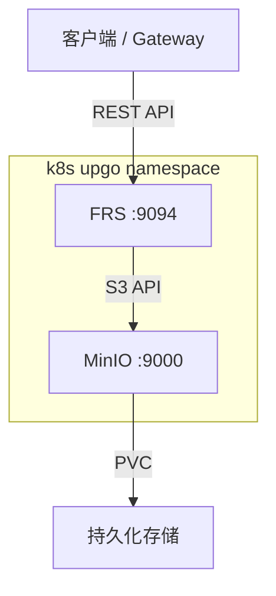

# FRS (File Repository Service) 设计文档

> 文件存储管理服务，基于 MinIO (S3-compatible) 构建

---

## 架构



## 数据流

### 上传文件
```
Client → POST /api/files/upload?key=xxx {body}
       → FRS upload() → MinIO put_object()
       ← { key, etag }
```

### 下载文件
```
Client → GET /api/files/download/{key}
       → FRS download() → MinIO get_object()
       ← stream(file content)
```

### 预签名 URL（大文件直传）
```
Client → POST /api/files/presigned/upload { key, expires_secs }
       → FRS gen presigned URL → MinIO
       ← { url, key }
Client → PUT {url} → MinIO (直接上传，不经过 FRS)
```

## 技术选型

| 组件 | 选择 | 原因 |
|------|------|------|
| 对象存储 | MinIO | 兼容 S3 API，支持 PVC 持久化，轻量 |
| S3 客户端 | `aws-sdk-s3` | 官方 SDK，支持 Presigned URL |
| HTTP 框架 | Axum | 与项目其他服务一致 |
| 文件嵌入 | `rust-embed` | 前端静态文件编译进二进制 |

## API 接口

| 方法 | 路径 | 说明 |
|------|------|------|
| POST | `/api/files/upload?key=xxx` | 上传文件（key 可选，为空自动生成 UUID） |
| GET | `/api/files/download/{key}` | 下载文件（流式返回） |
| DELETE | `/api/files/delete/{key}` | 删除文件 |
| GET | `/api/files/info/{key}` | 获取文件元信息（大小、类型、etag） |
| GET | `/api/files/list?prefix=xxx` | 按前缀列出文件 |
| POST | `/api/files/presigned/upload` | 生成预签名上传 URL（大文件直传） |
| GET | `/api/files/presigned/download/{key}` | 生成预签名下载 URL |

## 配置项

| 环境变量 | 默认值 | 说明 |
|----------|--------|------|
| `HTTP_ADDR` | `0.0.0.0:9094` | HTTP 监听地址 |
| `GRPC_ADDR` | `0.0.0.0:50054` | gRPC 监听地址 |
| `LOG_LEVEL` | `info` | 日志级别 |
| `S3_ENDPOINT` | `http://minio:9000` | MinIO S3 端点 |
| `S3_REGION` | `us-east-1` | S3 区域 |
| `S3_ACCESS_KEY` | `minioadmin` | MinIO 访问密钥 |
| `S3_SECRET_KEY` | `minioadmin` | MinIO 秘密密钥 |
| `S3_BUCKET` | `upgo-files` | 默认存储桶 |

## MinIO 配置

| 配置项 | 值 |
|--------|-----|
| 镜像 | `quay.io/minio/minio:latest` |
| 端口 | 9000 (S3) / 9001 (Console) |
| 存储 | 10Gi PVC (ReadWriteOnce) |
| 认证 | minioadmin / minioadmin |
| 健康检查 | `/minio/health/live` (liveness) / `/minio/health/ready` (readiness) |

## 部署依赖

- FRS 依赖 MinIO StatefulSet 先就绪
- 使用 init container `wait-for-minio` 确保 MinIO 启动后再启动 FRS
- Gateway 代理 `/api/files/*` 到 FRS :9094
