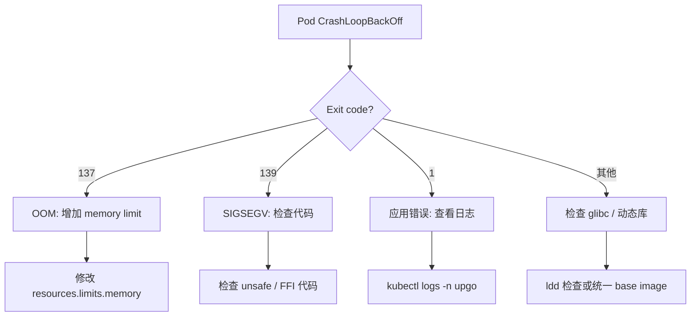

# upgo k8s 部署 Runbook — 问题排查与固化规则

> 记录所有已遇到的服务 Crash 问题、根因分析、修复方案，以及后续开发必须遵守的规则。

---

## 规则总览

| # | 规则 | 违反后果 | 对应问题 |
|---|------|----------|----------|
| 1 | [Dockerfile 构建层缓存](#1-dockerfile-构建层缓存优化) | 构建超时（>15min） | FRS 构建超时 |
| 2 | [多阶段运行时版本一致](#2-多阶段运行时版本一致) | `GLIBC_X.X not found` 崩溃 | FRS glibc 不匹配 |
| 3 | [Pod 内存资源评估](#3-pod-内存资源评估) | Exit 137 (OOMKilled) 无限重启 | Config-Manager OOM |
| 4 | [基础设施 Service 完整性](#4-基础设施-service-完整性) | 服务 DNS 解析失败 CrashLoop | SigNoz→ClickHouse 连接 |
| 5 | [AWS SDK features 完整性](#5-aws-sdk-features-完整性) | 启动 panic 崩溃 | FRS behavior-version-latest |
| 6 | [基础设施 StatefulSet 持久化](#6-基础设施-statefulset-持久化) | 命名空间清理后数据丢失 | ClickHouse 被删除 |
| 7 | [依赖库版本匹配](#7-依赖库版本匹配) | 编译失败或运行 panic | Dagger SDK/go.mod 版本不一致 |

---

## 规则详解

### 1. Dockerfile 构建层缓存优化

**问题**：FRS 构建持续超时（>15 分钟），因为 `aws-sdk-s3` 每次从头编译。

**根因**：`COPY . .` 使 Docker 层缓存失效，导致每次构建都重新下载并编译所有依赖。

**规则**：Dockerfile 必须分层构建，将依赖编译与源码编译分离。

```dockerfile
# ✅ 正确：先 COPY 依赖清单，编译依赖，再 COPY 源码
FROM rust:slim AS builder
WORKDIR /app

# Step 1: 只 COPY 依赖清单
COPY Cargo.toml Cargo.lock ./
COPY services/frs/Cargo.toml services/frs/Cargo.toml
COPY lib/telemetry/Cargo.toml lib/telemetry/Cargo.toml

# Step 2: 编译依赖（创建假的 main.rs）
RUN mkdir -p services/frs/src lib/telemetry/src && \
    echo "fn main() {}" > services/frs/src/main.rs && \
    echo "" > lib/telemetry/src/lib.rs && \
    cargo build --release -p frs 2>/dev/null || true

# Step 3: COPY 真实源码编译（只有改动的文件会重新编译）
COPY . .
RUN cargo build --release -p frs
```

> 效果：依赖编译被缓存，首次构建 15min → 后续仅需 ~2min。

---

### 2. 多阶段运行时版本一致

**问题**：FRS 启动报 `GLIBC_2.38 not found`，`CrashLoopBackOff`。

**根因**：Builder 阶段 `rust:slim` 基于较新的 `debian` 快照（glibc 2.38），Runtime 阶段 `debian:bookworm-slim` 是旧缓存（glibc 2.36）。二进制在 builder 中链接了 2.38 的符号，运行时找不到。

**规则**：多阶段构建的 **runtime 阶段必须使用与 builder 相同的 base image**，或明确使用同一个 tag。

```dockerfile
# ❌ 错误：不同 base image，glibc 可能不一致
FROM rust:slim AS builder
FROM debian:bookworm-slim          # ← 可能不同版本

# ✅ 正确：runtime 用相同的 base image
FROM rust:slim AS builder
FROM rust:slim                     # ← 保证 glibc 完全一致
```

> 或者使用 `debian:bookworm-20240615-slim` 等固定日期 tag 锁定版本。

---

### 3. Pod 内存资源评估

**问题**：Config-Manager 无限 CrashLoop，`Exit Code: 137`（SIGKILL / OOM）。

**根因**：`reqwest` HTTP 客户端 + Axum server + JSON 序列化需要足够的内存，初始 64Mi 限制远低于实际使用量。

**规则**：
- Rust 服务（含 Axum + reqwest）的 pod 初始内存应设为 **256Mi request / 512Mi limit**
- 运行后再根据实际使用调整
- 通过 `kubectl top pod` 或容器内 `/proc/self/status` 监控实际内存

```yaml
# ✅ 初始推荐配置
resources:
  requests:
    memory: "256Mi"
    cpu: "200m"
  limits:
    memory: "1Gi"
    cpu: "500m"
```

| 服务类型 | 推荐 request | 推荐 limit |
|----------|-------------|-----------|
| 纯静态文件/Gateway | 16Mi | 32Mi |
| 简单 REST 服务（reqwest） | 128Mi | 512Mi |
| 带 AWS SDK 的服务 | 256Mi | 1Gi |
| gRPC 服务 | 128Mi | 256Mi |

---

### 4. 基础设施 Service 完整性

**问题**：SigNoz Collector 启动报 `dial tcp: lookup clickhouse: no such host`。

**根因**：清理 default 命名空间时删除了 ClickHouse Service，但 SigNoz Collector 的配置文件中写死了 `clickhouse` 作为后端地址，导致 DNS 解析失败。

**规则**：每个 StatefulSet 必须有对应的 **Service** 注册到 kustomization.yaml，删除必须显式确认。

```bash
# ✅ 每次修改 k8s 资源后验证
kubectl kustomize k8s/overlays/dev > /dev/null

# ✅ 验证所有 Service 都有对应的 DNS 可达
kubectl get svc -n upgo
kubectl run test-dns --image=busybox --rm -it -- nslookup clickhouse
```

---

### 5. AWS SDK features 完整性

**问题**：FRS 启动 panic：`A behavior major version must be set... enable the behavior-version-latest cargo feature`。

**根因**：`aws-sdk-s3` 需要显式启用 `behavior-version-latest` feature，否则会在运行时 panic。

**规则**：使用 AWS SDK 的 crate 必须启用 `behavior-version-latest` feature：

```toml
# ❌ 错误：运行时 panic
aws-sdk-s3 = "1"

# ✅ 正确
aws-sdk-s3 = { version = "1", features = ["behavior-version-latest"] }
aws-config = { version = "1", features = ["behavior-version-latest"] }
```

---

### 6. 基础设施 StatefulSet 持久化

**问题**：`kubectl delete all --all -n default` 删除了 ClickHouse StatefulSet，导致 SigNoz 不可用。

**根因**：`delete all` 会删除所有 Deployment / StatefulSet / Pod，包括持久化数据。

**规则**：
- 不要对 `default` 命名空间执行 `delete all`，除非明确知道后果
- 迁移到独立 namespace（已完成 `upgo`）
- 有状态服务（StatefulSet + PVC）删除前必须确认数据已备份或可重建

```bash
# ✅ 安全清理：只清理业务 Pod，保留基础设施
kubectl delete deployment -n upgo -l 'app not in (postgres,minio,clickhouse)'

# ❌ 危险：会删除所有 StatefulSet 和数据
kubectl delete all --all -n <namespace>
```

---

### 7. 依赖库版本匹配

**问题**：Dagger CI 中 `dagger.json` 声明的 engine version 与 `go.mod` 中的 SDK version 不一致。

**根因**：`dagger.json` engineVersion `v0.21.4` 但 `go.mod` 锁定 `dagger.io/dagger v0.21.0`。

**规则**：`dagger.json` 的 `engineVersion` 必须与 `go.mod` 中 `dagger.io/dagger` 版本匹配：

```bash
# ✅ 验证
grep engineVersion ci/dagger.json
grep 'dagger.io/dagger' ci/go.mod
# 两者应一致 (e.g., v0.21.4)
```

---

## 快速诊断流程



## 故障排查命令集

```bash
# ── 诊断系列 ──────────────────────────────────────────
kubectl describe pod -n upgo <pod>    # 查看事件、状态、Exit Code
kubectl logs -n upgo <pod> --tail=50  # 查看最近日志
kubectl get events -n upgo --sort-by='.lastTimestamp'  # 集群事件

# ── 资源系列 ──────────────────────────────────────────
kubectl top pod -n upgo               # Pod 实时资源（需 metrics-server）
kubectl describe node minikube         # 节点资源分配

# ── 网络系列 ──────────────────────────────────────────
kubectl exec -n upgo deploy/auth -- nslookup postgres  # DNS 解析测试
kubectl run test --image=busybox -it --rm -- wget -qO- http://postgres:5432

# ── 修复系列 ──────────────────────────────────────────
kubectl rollout restart deployment -n upgo <name>
kubectl delete pod -n upgo <pod> --force  # 强制删除停滞 Pod
kubectl set resources deployment -n upgo <name> --limits memory=1Gi
```
